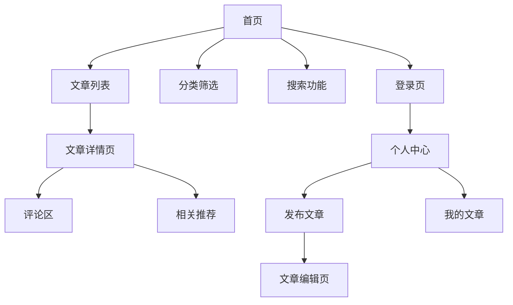

## 1. 产品概述
现代化的博客系统，支持文章发布、分类管理和用户互动。为内容创作者提供简洁高效的写作平台，为读者提供优质的内容阅读体验。

- 解决内容创作者缺乏专业发布平台的问题
- 面向个人博主、技术写作者和内容创作者
- 提供直观的写作界面和完善的读者互动功能

## 2. 核心功能

### 2.1 用户角色
| 角色 | 注册方式 | 核心权限 |
|------|----------|----------|
| 普通访客 | 无需注册 | 浏览文章、发表评论 |
| 注册用户 | 邮箱注册 | 发布文章、管理个人内容、评论互动 |
| 管理员 | 后台分配 | 管理所有内容、用户管理、系统设置 |

### 2.2 功能模块
博客系统包含以下核心页面：
1. **首页**：文章列表展示、分类导航、搜索功能
2. **文章详情页**：文章内容展示、评论区、相关推荐
3. **发布编辑页**：富文本编辑器、标签选择、分类设置
4. **个人中心**：个人信息管理、我的文章列表
5. **登录注册页**：用户认证、密码找回

### 2.3 页面详情
| 页面名称 | 模块名称 | 功能描述 |
|----------|----------|----------|
| 首页 | 顶部导航 | 显示网站logo、搜索框、用户登录状态 |
| 首页 | 文章列表 | 展示最新文章，支持分页加载 |
| 首页 | 分类筛选 | 按分类筛选文章，支持多选 |
| 首页 | 侧边栏 | 显示热门文章、标签云、归档 |
| 文章详情页 | 文章头部 | 显示标题、作者、发布时间、阅读量 |
| 文章详情页 | 文章内容 | 富文本内容展示，支持代码高亮 |
| 文章详情页 | 评论区 | 用户发表评论，支持回复功能 |
| 发布编辑页 | 编辑器 | 支持Markdown和富文本两种模式 |
| 发布编辑页 | 元数据设置 | 设置文章分类、标签、摘要 |
| 发布编辑页 | 发布操作 | 保存草稿、预览、正式发布 |
| 个人中心 | 个人信息 | 修改昵称、头像、个人简介 |
| 个人中心 | 文章管理 | 查看、编辑、删除自己的文章 |
| 登录注册页 | 登录表单 | 邮箱密码登录，支持记住登录 |
| 登录注册页 | 注册表单 | 邮箱验证注册，密码强度检查 |

## 3. 核心流程

### 普通用户流程
用户访问首页浏览文章列表，可以通过分类筛选感兴趣的内容。点击文章标题进入详情页阅读全文，在底部评论区参与讨论。注册用户还可以发布自己的文章，在编辑器中输入内容，选择分类和标签后发布。

### 管理员流程
管理员登录后可以进入后台管理界面，审核用户发布的文章，管理用户账户，设置网站基本信息。

## 4. 用户界面设计

### 4.1 设计风格
- **主色调**：使用 `bg-brand-primary` 作为主要品牌色
- **按钮样式**：采用圆角设计，主要按钮使用渐变色 `bg-[#F5A623] hover:bg-[#E09612]`
- **字体规范**：正文字号 `text-[14px]`，标题按比例放大
- **布局风格**：卡片式布局，响应式网格系统
- **图标风格**：使用简洁的线性图标，与整体设计风格统一

### 4.2 页面设计概览
| 页面名称 | 模块名称 | UI元素 |
|----------|----------|--------|
| 首页 | 导航栏 | 固定顶部，包含logo和用户信息，使用 `text-brand-primary` 高亮当前页面 |
| 首页 | 文章卡片 | 圆角卡片设计，包含封面图、标题、摘要，使用 `line-clamp-3` 控制摘要长度 |
| 文章详情 | 内容区域 | 最大宽度限制，代码块使用语法高亮，图片自适应宽度 |
| 评论区 | 评论列表 | 层级缩进显示回复关系，支持点赞和回复操作 |
| 编辑器 | 工具栏 | 固定顶部，包含格式化和发布按钮，底部有固定操作栏 |

### 4.3 响应式设计
采用桌面优先设计，在移动端自适应调整：
- 桌面端：多栏布局，侧边栏显示辅助信息
- 平板端：单栏布局，侧边栏移至底部
- 移动端：简化导航，优化触摸操作，底部按钮适配 `pb-[env(safe-area-inset-bottom)]`

### 4.4 交互规范
- 使用方法调用式Modal：`modal.confirm()`、`modal.success()`
- 全局loading状态：`useGlobalLoading` 统一管理
- 空状态处理：使用 `ContentEmpty` 组件统一展示
- 错误处理：使用 `notifications.show` 显示操作反馈
- 路由参数：使用 `useSearchParams` 获取查询参数