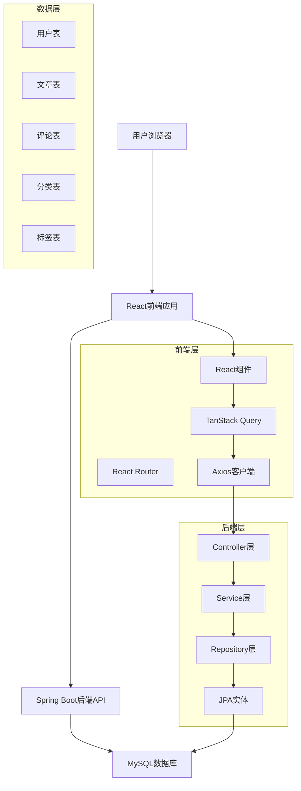
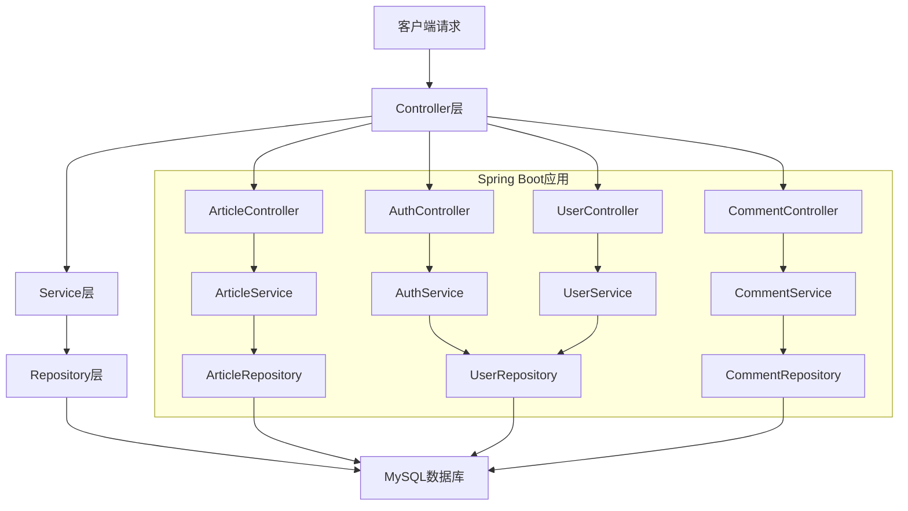
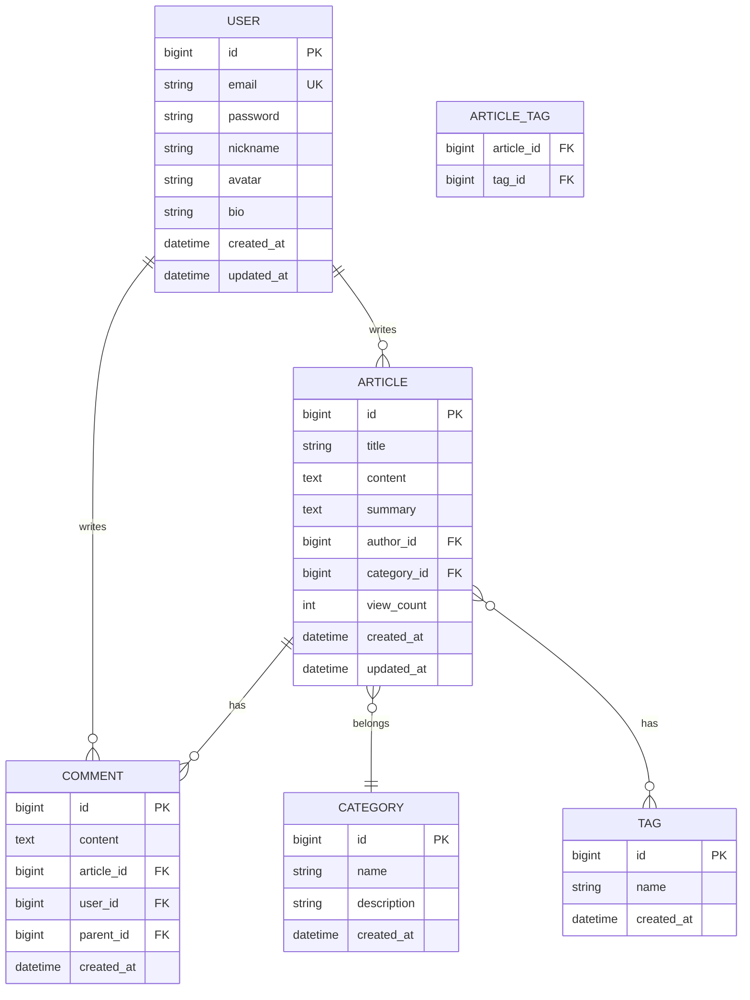

## 1. 架构设计



## 2. 技术栈描述

- **前端**: React@18 + TypeScript + TailwindCSS@3 + Vite
- **初始化工具**: vite-init
- **后端**: Spring Boot@3 + Java 17 + Spring Security + Spring Data JPA
- **数据库**: MySQL 8.0
- **主要依赖**:
  - 前端: @tanstack/react-query, react-router-dom, axios
  - 后端: spring-boot-starter-web, spring-boot-starter-security, spring-boot-starter-data-jpa, mysql-connector-j

## 3. 路由定义

| 路由 | 用途 |
|------|------|
| / | 首页，展示文章列表 |
| /article/:id | 文章详情页 |
| /publish | 发布新文章 |
| /edit/:id | 编辑文章 |
| /profile | 个人中心 |
| /login | 登录页面 |
| /register | 注册页面 |
| /category/:id | 分类文章列表 |
| /tag/:id | 标签文章列表 |

## 4. API定义

### 4.1 认证相关API

```
POST /api/auth/login
```

请求:
| 参数名 | 参数类型 | 是否必需 | 描述 |
|--------|----------|----------|------|
| email | string | 是 | 用户邮箱 |
| password | string | 是 | 用户密码 |

响应:
| 参数名 | 参数类型 | 描述 |
|--------|----------|------|
| token | string | JWT令牌 |
| user | object | 用户信息 |

### 4.2 文章相关API

```
GET /api/articles
```

查询参数:
| 参数名 | 参数类型 | 描述 |
|--------|----------|------|
| page | number | 页码，默认1 |
| size | number | 每页数量，默认10 |
| category | string | 分类ID |
| tag | string | 标签ID |

```
POST /api/articles
```

请求体:
| 参数名 | 参数类型 | 是否必需 | 描述 |
|--------|----------|----------|------|
| title | string | 是 | 文章标题 |
| content | string | 是 | 文章内容 |
| summary | string | 否 | 文章摘要 |
| categoryId | number | 是 | 分类ID |
| tagIds | array | 否 | 标签ID数组 |

### 4.3 评论相关API

```
POST /api/articles/:id/comments
```

请求体:
| 参数名 | 参数类型 | 是否必需 | 描述 |
|--------|----------|----------|------|
| content | string | 是 | 评论内容 |
| parentId | number | 否 | 父评论ID |

## 5. 服务器架构图



## 6. 数据模型

### 6.1 数据模型定义



### 6.2 数据定义语言

用户表 (users)
```sql
CREATE TABLE users (
  id BIGINT PRIMARY KEY AUTO_INCREMENT,
  email VARCHAR(255) UNIQUE NOT NULL,
  password VARCHAR(255) NOT NULL,
  nickname VARCHAR(100) NOT NULL,
  avatar VARCHAR(500),
  bio TEXT,
  created_at TIMESTAMP DEFAULT CURRENT_TIMESTAMP,
  updated_at TIMESTAMP DEFAULT CURRENT_TIMESTAMP ON UPDATE CURRENT_TIMESTAMP,
  INDEX idx_email (email)
);
```

文章表 (articles)
```sql
CREATE TABLE articles (
  id BIGINT PRIMARY KEY AUTO_INCREMENT,
  title VARCHAR(255) NOT NULL,
  content TEXT NOT NULL,
  summary TEXT,
  author_id BIGINT NOT NULL,
  category_id BIGINT NOT NULL,
  view_count INT DEFAULT 0,
  created_at TIMESTAMP DEFAULT CURRENT_TIMESTAMP,
  updated_at TIMESTAMP DEFAULT CURRENT_TIMESTAMP ON UPDATE CURRENT_TIMESTAMP,
  FOREIGN KEY (author_id) REFERENCES users(id),
  FOREIGN KEY (category_id) REFERENCES categories(id),
  INDEX idx_author (author_id),
  INDEX idx_category (category_id),
  INDEX idx_created_at (created_at DESC)
);
```

评论表 (comments)
```sql
CREATE TABLE comments (
  id BIGINT PRIMARY KEY AUTO_INCREMENT,
  content TEXT NOT NULL,
  article_id BIGINT NOT NULL,
  user_id BIGINT NOT NULL,
  parent_id BIGINT,
  created_at TIMESTAMP DEFAULT CURRENT_TIMESTAMP,
  FOREIGN KEY (article_id) REFERENCES articles(id),
  FOREIGN KEY (user_id) REFERENCES users(id),
  FOREIGN KEY (parent_id) REFERENCES comments(id),
  INDEX idx_article (article_id),
  INDEX idx_user (user_id)
);
```

分类表 (categories)
```sql
CREATE TABLE categories (
  id BIGINT PRIMARY KEY AUTO_INCREMENT,
  name VARCHAR(100) NOT NULL,
  description TEXT,
  created_at TIMESTAMP DEFAULT CURRENT_TIMESTAMP,
  UNIQUE KEY uk_name (name)
);
```

标签表 (tags)
```sql
CREATE TABLE tags (
  id BIGINT PRIMARY KEY AUTO_INCREMENT,
  name VARCHAR(50) NOT NULL,
  created_at TIMESTAMP DEFAULT CURRENT_TIMESTAMP,
  UNIQUE KEY uk_name (name)
);
```

文章标签关联表 (article_tags)
```sql
CREATE TABLE article_tags (
  article_id BIGINT NOT NULL,
  tag_id BIGINT NOT NULL,
  PRIMARY KEY (article_id, tag_id),
  FOREIGN KEY (article_id) REFERENCES articles(id) ON DELETE CASCADE,
  FOREIGN KEY (tag_id) REFERENCES tags(id) ON DELETE CASCADE
);
```